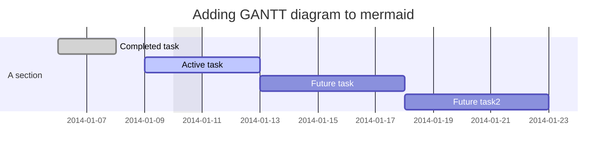

## 🗞 News

### Visual Studio Code 1.59 发布

- 扩展视图进行了一些改进：丰富了悬停时的扩展详细信息，设置了新的运行时状态选项卡

- 设置编辑器引入验证功能：设置编辑器现在支持对象验证

- 拖放终端方面进行了改进：现在能将终端跨窗口移动到编辑器和面板区域

- 自定义扩展主题：一次设置多个颜色主题

- 内置对 Jupyter notebooks 支持：`.ipynb` 文件现在能直接在 VS Code 中打开

- 改进了Notebook UI：显示折叠单元格的第一行

- 首批测试 API 已经完成：支持在 VS Code 中使用内置测试资源管理器运行测试

- 调试反汇编视图预览：在 VS Code 中显示反汇编的 C++ 代码

- 实时预览插件有了新功能：VS Code 现在支持实时 HTML 预览，支持 JavaScript 调试

- Remote - Containers devcontainer CLI：引入用于处理开发容器的命令行界面

Release：[Visual Studio Code July 2021](https://code.visualstudio.com/updates/v1_59#_remote-containers-devcontainer-cli)

### Svelte 首款 IDE 发布

首款基于 Electron 和 Svelte 开发的 IDE 正式发布。

GitHub Repo：[oslabs-beta/SvelteStorm](https://github.com/oslabs-beta/SvelteStorm)

Home Page：[SvelteStorm](https://sveltestorm.com/)

## 📦 Open Source

### html-to-image

一个基于 [dom-to-image](https://github.com/tsayen/dom-to-image) 改造并添加的一些新特性的 HTML 转图片库。

GitHub Repo：[bubkoo/html-to-image](https://github.com/bubkoo/html-to-image)

### vanilla-extract

零运行时的 CSS in TS 方案。允许你使用 TypeScript（或 JavaScript）编写样式，允许使用 CSS Variables，并且会生成 scoped className，这些都会在编译时被编译为静态的 CSS 文件。

GitHub Repo：[seek-oss/vanilla-extract](https://github.com/seek-oss/vanilla-extract)

CodeSandbox Demo：[vanilla-extract-webpack-react - CodeSandbox](https://codesandbox.io/s/github/seek-oss/vanilla-extract/tree/master/examples/webpack-react?file=/src/App.css.ts)

### Neon

用于编写安全、快速的原生 Node.js 模块的 Rust binding。

GitHub Repo：[neon-bindings/neon](https://github.com/neon-bindings/neon)

### Sequelize-Auto

通过命令行自动生成基于 Sequelize 的 model。

GitHub Repo：[sequelize/sequelize-auto](https://github.com/sequelize/sequelize-auto)

### Mermaid

采用类 Markdown 的方式从文本生成图表和流程图。

很多同学都在使用 Typora 做 Markdown 编辑器，Mermaid 就是 Typora 内置的作图工具，能够让你使用类 Markdown 的语法生成各种图表和流程图，语法非常简洁易懂。

举例，如果需要生成一个简单的流程图，只需要在 Typora 中输入代码块，选择语言为 mermaid 即可。

````markdown

````

对应的流程图是这样的：


不仅能够画流程图，还能画甘特图。

````markdown

````

对应的甘特图是这样的：


GitHub Repo：[mermaid-js/mermaid](https://github.com/mermaid-js/mermaid)

Documentation：[mermaid - Markdownish syntax for generating flowcharts, sequence diagrams, class diagrams, gantt charts and git graphs.](https://mermaid-js.github.io/mermaid/#/)

## 📑 Article

### Safari isn't protecting the web, it's killing it

最近有很多关于“Safari 是新的 IE”的讨论，也有人说“Safari 实际上是在保护 Web，它拒绝添加那些可能造成安全/隐私/体积问题的实验性特性”，众说纷纭。

文章从各个角度对“Safari isn't protecting the web, it's killing it”这一观点进行了阐述，非常值得学习和思考！

原文链接：[Safari isn't protecting the web, it's killing it](https://httptoolkit.tech/blog/safari-is-killing-the-web/)

### 用「增量」思想提升代码检查和打包构建的效率

推荐这篇文章的原因是近期团队在开发过程中受到了 Lint 时间上的困扰，无论是本地还是 CI，Lint 时间都偏长。

文章详细介绍了如何实现文件级别的增量代码检查和增量打包构建，非常值得学习！

原文链接：[用「增量」思想提升代码检查和打包构建的效率](https://juejin.cn/post/6865101730166767623)

### 客户端产品一般是用什么编程语言写的？

回答详细介绍了作者使用 Rust、Neon、Electron 作为客户端产品技术选型的原因，并针对其中的一些问题做了详细解答。

原文链接：[客户端产品一般是用什么编程语言写的？](https://www.zhihu.com/question/19903210/answer/207779913)

### React IO 组件 & 锁

文章详细讲解了如何在 React 中实现一个能够在受控组件和非受控组件之间切换的输入框组件，顺便介绍了一些与锁有关的的计算机基础知识，非常值得学习！

原文链接：[React IO组件 & 锁](https://zhuanlan.zhihu.com/p/397113369)

### 你真的了解 JAMStack 吗？

文章详细介绍了 JAMStack 的工作流，并对 JAMStack 的优缺点及适用场景做了较为深入的分析，非常值得学习！

原文链接：[Jamstack，你真的了解它吗？](https://mp.weixin.qq.com/s/bVkK2jJAuZmShYk4318kMQ)

